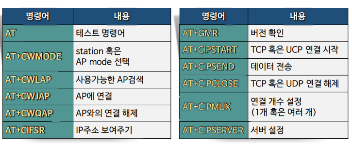

# aduino-iot

esp8266을 이욯한 iot

### 1.esp8266connect

- AT COMMEND를 이용해 WIFI 연결확인

- WIFIesp 라이브러리가 안되서 SoftSerial을 이용하자

### 2. AT COMMEND

- AT
  
  - OK반환시 정상적인 작동

- AT+RST
  
  - 모듈 리셋

- AT+GMR
  
  - 버전확인

- AT+CWMODE
  
  - WIFI모드확인또는 설정확인

- AT+CCWLAP
  
  - AP리스트 출력명령

- AT+CWJAP
  
  - AP접속명
    
    ```
    AT+CWJAP="ssid","password"
    ```


